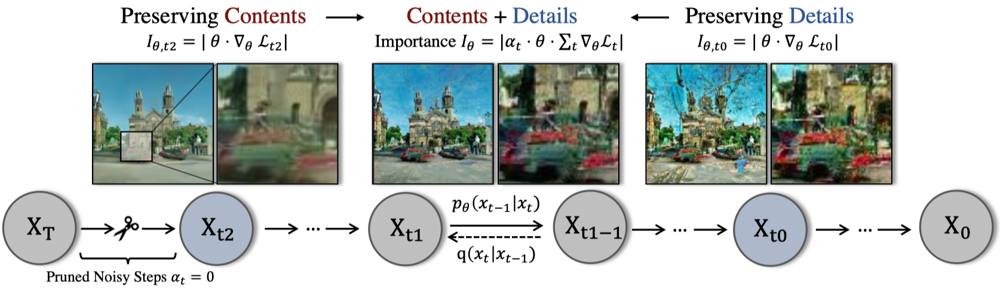
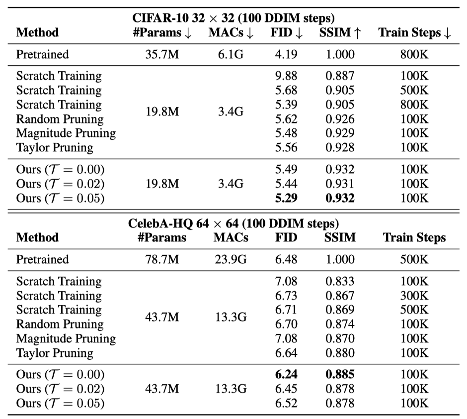

# Diff-Pruning: Structural Pruning for Diffusion Models

<div align="center">
</img>
</div>

## Update
Check our latest work [DeepCache](https://horseee.github.io/Diffusion_DeepCache/), a **training-free and almost loessless** method for diffusion model acceleration. It can be viewed as a special pruning technique that dynamically drops deep layers and only runs shallow ones during inference.


## Introduction
> **Structural Pruning for Diffusion Models** [[arxiv]](https://arxiv.org/abs/2305.10924)  
> *[Gongfan Fang](https://fangggf.github.io/), [Xinyin Ma](https://horseee.github.io/), [Xinchao Wang](https://sites.google.com/site/sitexinchaowang/)*    
> *National University of Singapore*

This work presents *Diff-Pruning*, an efficient structrual pruning method for diffusion models. Our empirical assessment highlights two primary features:
1) ``Efficiency``: It enables approximately a 50% reduction in FLOPs at a mere 10% to 20% of the original training expenditure; 
2) ``Consistency``: The pruned diffusion models inherently preserve generative behavior congruent with the pre-trained ones.

<div align="center">
</img>
</div>

### Supported Methods
- [x] Magnitude Pruning
- [x] Random Pruning
- [x] Taylor Pruning
- [x] Diff-Pruning (A taylor-based method proposed in our paper)   

### TODO List
- [ ] Support more diffusion models from Diffusers
- [ ] Upload checkpoints of pruned models
- [ ] Training scripts for CelebA-HQ, LSUN Church & LSUN Bedroom
- [ ] Align the performance with the [DDIM Repo](https://github.com/ermongroup/ddim). 

## Our Exp Code (Unorganized)

### Pruning with DDIM codebase
This example shows how to prune a DDPM model pre-trained on CIFAR-10 using the [DDIM codebase](https://github.com/ermongroup/ddim). Since that [Huggingface Diffusers](https://github.com/huggingface/diffusers) do not support [``skip_type='quad'``](https://github.com/ermongroup/ddim/issues/3) in DDIM, you may get slightly worse FID scores with Diffusers for both pre-trained models (FID=4.5) and pruned models (FID=5.6). We are working on this to implement the quad strategy for Diffusers. For reproducibility, we provide our original **but unorganized** exp code for the paper in [ddpm_exp](ddpm_exp). 

```bash
cd ddpm_exp
# Prune & Finetune
bash scripts/simple_cifar_our.sh 0.05 # the pre-trained model and data will be automatically prepared
# Sampling
bash scripts/sample_cifar_ddpm_pruning.sh run/finetune_simple_v2/cifar10_ours_T=0.05.pth/logs/post_training/ckpt_100000.pth run/sample
```

For FID, please refer to [this section](https://github.com/VainF/Diff-Pruning#4-fid-score).  

Output:
```
Found 49984 files.
100%|██████████████████████████████████████████████████████████████████████████████████████████████████████| 391/391 [00:49<00:00,  7.97it/s]
FID:  5.242662673752534
```

### Pruning with LDM codebase

Please check [ldm_exp/run.sh](ldm_exp/run.sh) for an example of pruning a pre-trained LDM model on ImageNet. This codebase is still unorganized. We will clean it up in the future.

## Pruning with Huggingface Diffusers

The following pipeline prunes a pre-trained DDPM on CIFAR-10 with [Huggingface Diffusers](https://github.com/huggingface/diffusers).

### 0. Requirements, Data and Pretrained Model

* Requirements
```bash
pip install -r requirements.txt
```
 
* Data
  
Download and extract CIFAR-10 images to *data/cifar10_images* for training and evaluation.
```bash
python tools/extract_cifar10.py --output data
```
* Pretrained Models
  
The following script will download an official DDPM model and convert it to the format of Huggingface Diffusers. You can find the converted model at *pretrained/ddpm_ema_cifar10*. It is an EMA version of [google/ddpm-cifar10-32](https://huggingface.co/google/ddpm-cifar10-32)
```bash
bash tools/convert_cifar10_ddpm_ema.sh
```

(Optional) You can also download a pre-converted model using wget
```bash
wget https://github.com/VainF/Diff-Pruning/releases/download/v0.0.1/ddpm_ema_cifar10.zip
```

### 1. Pruning
Create a pruned model at *run/pruned/ddpm_cifar10_pruned*
```bash
bash scripts/prune_ddpm_cifar10.sh 0.3  # pruning ratio = 30\%
```

### 2. Finetuning (Post-Training)
Finetune the model and save it at *run/finetuned/ddpm_cifar10_pruned_post_training*
```bash
bash scripts/finetune_ddpm_cifar10.sh
```

### 3. Sampling
**Pruned:** Sample and save images to *run/sample/ddpm_cifar10_pruned*
```bash
bash scripts/sample_ddpm_cifar10_pruned.sh
```

**Pretrained:** Sample and save images to *run/sample/ddpm_cifar10_pretrained*
```bash
bash scripts/sample_ddpm_cifar10_pretrained.sh
```

### 4. FID Score
This script was modified from https://github.com/mseitzer/pytorch-fid. 

```bash
# pre-compute the stats of CIFAR-10 dataset
python fid_score.py --save-stats data/cifar10_images run/fid_stats_cifar10.npz --device cuda:0 --batch-size 256
```

```bash
# Compute the FID score of sampled images
python fid_score.py run/sample/ddpm_cifar10_pruned run/fid_stats_cifar10.npz --device cuda:0 --batch-size 256
```

### 5. (Optional) Distributed Training and Sampling with Accelerate
This project supports distributed training and sampling. 
```bash
python -m torch.distributed.launch --nproc_per_node=8 --master_port 22222 --use_env <ddpm_sample.py|ddpm_train.py> ...
```
A multi-processing example can be found at [scripts/sample_ddpm_cifar10_pretrained_distributed.sh](scripts/sample_ddpm_cifar10_pretrained_distributed.sh).


## Prune Pre-trained DPMs from [HuggingFace Diffusers](https://huggingface.co/models?library=diffusers)

### :rocket: [Denoising Diffusion Probabilistic Models (DDPMs)](https://arxiv.org/abs/2006.11239)
Example: [google/ddpm-ema-bedroom-256](https://huggingface.co/google/ddpm-ema-bedroom-256)
```bash
python ddpm_prune.py \
--dataset "<path/to/imagefoler>" \  
--model_path google/ddpm-ema-bedroom-256 \
--save_path run/pruned/ddpm_ema_bedroom_256_pruned \
--pruning_ratio 0.05 \
--pruner "<random|magnitude|reinit|taylor|diff-pruning>" \
--batch_size 4 \
--thr 0.05 \
--device cuda:0 \
```
The ``dataset`` and ``thr`` arguments only work for taylor & diff-pruning.


### :rocket: [Latent Diffusion Models (LDMs)](https://arxiv.org/abs/2112.10752)
Example: [CompVis/ldm-celebahq-256](https://huggingface.co/CompVis/ldm-celebahq-256)
```bash
python ldm_prune.py \
--model_path CompVis/ldm-celebahq-256 \
--save_path run/pruned/ldm_celeba_pruned \
--pruning_ratio 0.05 \
--pruner "<random|magnitude|reinit>" \
--device cuda:0 \
--batch_size 4 \
```

## Results

* **DDPM on Cifar-10, CelebA and LSUN**

<div align="center">
</img>
</img>
</div>

* **Conditional LDM on ImageNet-1K 256**

We also have some results on Conditional LDM for ImageNet-1K 256x256, where we finetune a pruned LDM for only 4 epochs. Will release the training script soon.

<div align="center">
</img>
</img>
</div>


## Acknowledgement

This project is heavily based on [Diffusers](https://github.com/huggingface/diffusers), [Torch-Pruning](https://github.com/VainF/Torch-Pruning), [pytorch-fid](https://github.com/mseitzer/pytorch-fid). Our experiments were conducted on [ddim](https://github.com/ermongroup/ddim) and [LDM](https://github.com/CompVis/latent-diffusion).

## Citation
If you find this work helpful, please cite:
```
@inproceedings{fang2023structural,
  title={Structural pruning for diffusion models},
  author={Gongfan Fang and Xinyin Ma and Xinchao Wang},
  booktitle={Advances in Neural Information Processing Systems},
  year={2023},
}
```

```
@inproceedings{fang2023depgraph,
  title={Depgraph: Towards any structural pruning},
  author={Fang, Gongfan and Ma, Xinyin and Song, Mingli and Mi, Michael Bi and Wang, Xinchao},
  booktitle={Proceedings of the IEEE/CVF Conference on Computer Vision and Pattern Recognition},
  pages={16091--16101},
  year={2023}
}
```
