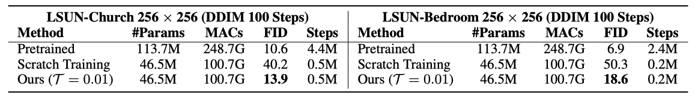

# Diff-Pruning: Structural Pruning for Diffusion Models

<div align="center">
</img>
</div>

## Introduction
This work presents *Diff-Pruning*, an efficient structrual pruning method for diffusion models. Our empirical assessment highlights two primary features:
1) ``Efficiency``: It enables approximately a 50% reduction in FLOPs at a mere 10% to 20% of the original training expenditure; 
2) ``Consistency``: The pruned diffusion models inherently preserve generative behavior congruent with the pre-trained ones.

> **Structural Pruning for Diffusion Models** [[arxiv]](https://arxiv.org/abs/2305.10924)  
> *[Gongfan Fang](https://fangggf.github.io/), [Xinyin Ma](https://horseee.github.io/), [Xinchao Wang](https://sites.google.com/site/sitexinchaowang/)*    
> *National University of Singapore*


<div align="center">
</img>
</div>

### Supported Pruners
- [x] Magnitude Pruner
- [x] Random Pruner
- [x] Taylor Pruner
- [x] Diff-Pruning (A taylor-based method proposed in our paper)   

### TODO List
- [ ] Support more diffusion models from Diffusers
- [ ] Upload checkpoints of pruned models
- [ ] Training scripts for CelebA-HQ, LSUN Church & LSUN Bedroom
- [ ] Align the performance with the [DDIM Repo](https://github.com/ermongroup/ddim). 

## Quick Start

This example shows how to prune a DDPM pre-trained on CIFAR-10. Note that Diffusers does not support ``skip_type='quad'`` in DDIM, you may get slightly worse FID scores for both pre-trained models (FID=4.5) and pruned models (FID=5.6). We are working on this to implement the quad strategy for Diffusers. Our original exp code for the paper is available at [exp_code](exp_code).

### 0. Data & Pretrained Model
Download and extract CIFAR-10 images to *data/cifar10_images*
```bash
python tools/extract_cifar10.py --output data
```

The following script will download an official DDPM model and pack it in the format of Huggingface Diffusers. You can find the converted model at *pretrained/ddpm_ema_cifar10*. It is an EMA version of [google/ddpm-cifar10-32](https://huggingface.co/google/ddpm-cifar10-32)
```bash
bash tools/convert_cifar10_ddpm_ema.sh
```

### 1. Pruning
Create a pruned model at *run/pruned/ddpm_cifar10_pruned*
```bash
bash scripts/prune_ddpm_cifar10.sh 0.3  # pruning ratio = 30\%
```

### 2. Finetuning (Post-Training)
Finetune the model and save it at *run/finetuned/ddpm_cifar10_pruned_post_training*
```bash
bash scripts/finetune_ddpm_cifar10.sh
```

### 3. Sampling
**Pruned:** Sample and save images to *run/sample/ddpm_cifar10_pruned*
```bash
bash scripts/sample_ddpm_cifar10_pruned.sh
```

**Pretrained:** Sample and save images to *run/sample/ddpm_cifar10_pretrained*
```bash
bash scripts/sample_ddpm_cifar10_pretrained.sh
```

Multi-processing sampling are supported. Please refer to [scripts/sample_ddpm_cifar10_pretrained_distributed.sh](scripts/sample_ddpm_cifar10_pretrained_distributed.sh).

### 4. FID score
This script was modified from https://github.com/mseitzer/pytorch-fid. 

```bash
# pre-compute the stats of CIFAR-10 dataset
python fid_score.py --save-stats data/cifar10_images run/fid_stats_cifar10.npz --device cuda:0 --batch-size 256
```

```bash
# Compute the FID score of sampled images
python fid_score.py run/sample/ddpm_cifar10_pruned run/fid_stats_cifar10.npz --device cuda:0 --batch-size 256
```

## Prune pre-trained DDPMs from Huggingface

Example: [google/ddpm-ema-bedroom-256](https://huggingface.co/google/ddpm-ema-bedroom-256)
```bash
python ddpm_prune.py \
--dataset "<path/to/imagefoler>" \  
--model_path google/ddpm-ema-bedroom-256 \
--save_path run/pruned/ddpm_ema_bedroom_256_pruned \
--pruning_ratio 0.05 \
--batch_size 4 \
--pruner "<random|magnitude|taylor|diff-pruning>" \
--thr 0.05 \
--device cuda:0 \
```
The ``dataset`` and ``thr`` arguments only work for taylor & diff-pruning.


## Results
<div align="center">
</img>
</img>
</div>


## Acknowledgement

This project is heavily based on [Diffusers](https://github.com/huggingface/diffusers), [Torch-Pruning](https://github.com/VainF/Torch-Pruning), [pytorch-fid](https://github.com/mseitzer/pytorch-fid). Our experiments were originally conducted on [ddim](https://github.com/ermongroup/ddim). 

## Citation
If you find this work helpful, please cite:
```
@article{fang2023structural,
  title={Structural pruning for diffusion models},
  author={Fang, Gongfan and Ma, Xinyin and Wang, Xinchao},
  journal={arXiv preprint arXiv:2305.10924},
  year={2023}
}
```

```
@article{fang2023depgraph,
  title={Depgraph: Towards any structural pruning},
  author={Fang, Gongfan and Ma, Xinyin and Song, Mingli and Mi, Michael Bi and Wang, Xinchao},
  journal={arXiv preprint arXiv:2301.12900},
  year={2023}
}
```
