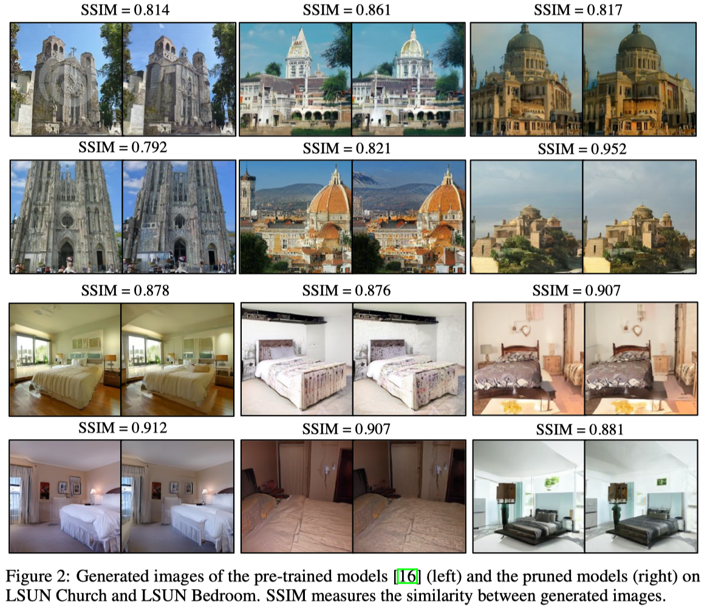

# Diff-Pruning: Structural Pruning for Diffusion Models

## Intro

This work present *Diff-Pruning*, an efficient compression method tailored for learning lightweight diffusion models from pre-existing ones, without the need for extensive re-training. The essence of *Diff-Pruning* is encapsulated in a Taylor expansion over pruned timesteps, a process that disregards non-contributory diffusion steps and ensembles informative gradients to identify important weights. Our empirical assessment, undertaken across four diverse datasets highlights two primary benefits of our proposed method: 1) ``Efficiency``: it enables approximately a 50% reduction in FLOPs at a mere 10% to 20% of the original training expenditure; 2) ``Consistency``: the pruned diffusion models inherently preserve generative behavior congruent with their pre-trained progenitors.


<div align="center">
</img>
</div>

## Quick Start

### 1. Prune a pretrained DDPMs on CIFAR-10
```bash
bash scripts/prune_ddpm_cifar10.sh 0.3  # pruning ratio = 30\%
```

### 2. Finetune the pruned diffusion model
```bash
bash scripts/finetune_ddpm_cifar10.sh
```

### 3. Sampling from pre-trained models
```bash
bash sample_ddpm_cifar10.sh
```

## Results
<div align="center">
</img>
</div>

## Citation
If you find this work helpful, please cite:
```
@article{fang2023structural,
  title={Structural pruning for diffusion models},
  author={Fang, Gongfan and Ma, Xinyin and Wang, Xinchao},
  journal={arXiv preprint arXiv:},
  year={2023}
}
```

```
@article{fang2023depgraph,
  title={Depgraph: Towards any structural pruning},
  author={Fang, Gongfan and Ma, Xinyin and Song, Mingli and Mi, Michael Bi and Wang, Xinchao},
  journal={arXiv preprint arXiv:2301.12900},
  year={2023}
}
```